## TODO

## Feature ideas

- collectable power-ups
- allow weapon systems to process (or ignore) standard upgrades: shot-speed, shot number, dmg, fire rate, electric-dmg, fire-dmg, ice-dmg, shot spread increase/decrease, chain lightning, explosive...
- various mobs with different emergent behaviours through interactions and desires
- A noita-like modular weapon construction system

## Refactoring ideas

- sort type issues
- use events to make it easier for us to have entities react to changes in other entities (e.g. ooh, X died, I should go scavenge, or become stronger / berserk)

## Done

- A pause system that slows down time until stopped, and then speeds up until normal speed on resume
- refactor: combine all into one entity list

# Features Mindmap

```mermaid
%%{init: {'theme': 'default'}}%%
mindmap
  root((space shooter))
    Playstyle
      roguelike run
      risk+reward💰
      chaotic ⚛🃏
      brutish +<br/>short 🗡️
    Weapons
      Composable ➕
      varied
        elemental<br/>damage ❄️🔥
        spacePlague 🦠
        EMP 🍳
        chain-lightning ⚡️
        poison ☠️🧪
      interact w<br/>environ
      collectable 🛒
      upgradable 🔨
    Relics 🏛️<br/>from STS
      run-changing<br/>behaviours
    Enemies
      Emergent<br/>Behaviours
      Risk + Reward
        commandeer 🏴‍☠️<br/>oversized enemy?
        Steal a weapon +<br/>flee
        leech resources
      elemental<br/>weaknesses +<br/>resistances
      Harvestable 🌾
      Rare drops: Relics 🏛️
    Neutral mobs
      elemental<br/>traits<br/>🔥❄️💨🍃
      emergent<br/>behaviours
      varied character
        hulking slow
        nimble swarming
      manipulable
        destroy enemies
        mining ⛏️
        aggro gone wrong
```

Note:

- [mermaid mindmap diagram documentation](https://mermaid.js.org/syntax/mindmap.html)
